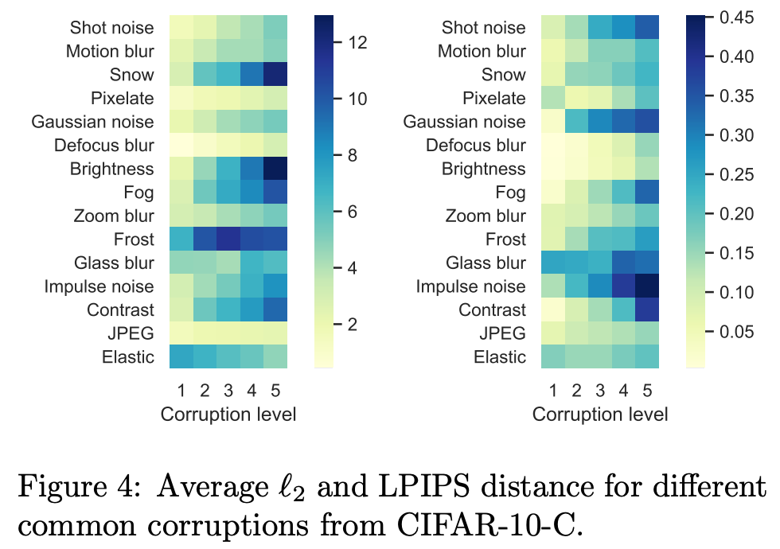
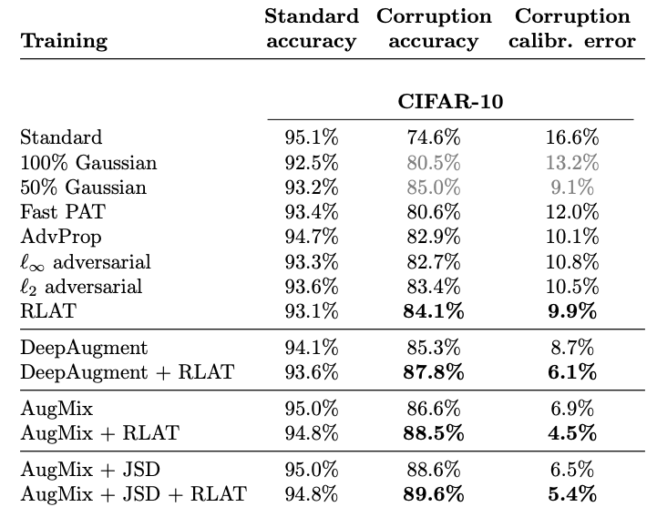
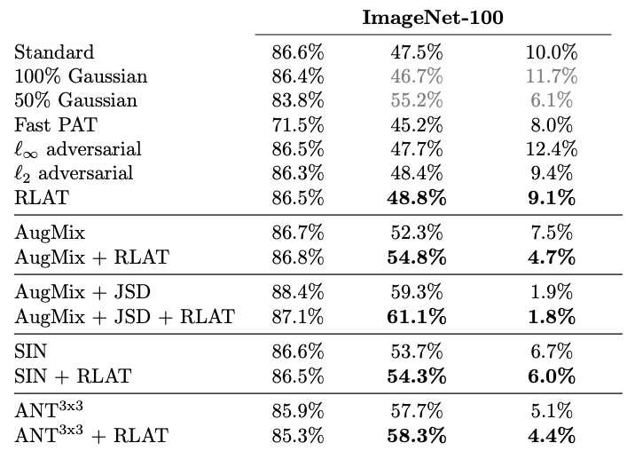

# On the effectiveness of adversarial training against common corruptions

**Klim Kireev\* (EPFL), Maksym Andriushchenko\* (EPFL), Nicolas Flammarion (EPFL)**

**Paper:** [https://arxiv.org/abs/2103.02325](https://arxiv.org/abs/2103.02325)

\*Equal contribution.

## Abstract
The literature on robustness towards common corruptions shows no consensus on whether adversarial training can improve 
the performance in this setting. First, we show that, when used with an appropriately selected perturbation radius, Lp 
adversarial training can serve as a strong baseline against common corruptions. Then we explain why adversarial training 
performs better than data augmentation with simple Gaussian noise which has been observed to be a meaningful baseline on 
common corruptions. Related to this, we identify the *σ-overfitting phenomenon* when Gaussian augmentation overfits to a 
particular standard deviation used for training which has a significant detrimental effect on common corruption accuracy. 
We discuss how to alleviate this problem and then how to further enhance Lp adversarial training by introducing an 
efficient relaxation of adversarial training with learned perceptual image patch similarity as the distance metric. 
Through experiments on CIFAR-10 and ImageNet-100, we show that our approach does not only improve the Lp adversarial 
training baseline but also has cumulative gains with data augmentation methods such as AugMix, ANT, and SIN leading to 
state-of-the-art performance on common corruptions.

## About the paper
First of all, we observe that even Lp adversarial training (e.g., for p in {2, inf}) can lead to significant improvements on common corruptions
and be competitive to other natural baselines:

    
    

Next, we discuss the *σ-overfitting phenomenon* when Gaussian augmentation overfits to a particular standard deviation used for training. 
This can be seen particularly clearly on ImageNet-100:

As we show in the experimental part, this leads to significantly suboptimal results on common corruptions that, however, 
can be improved by augmenting only 50% images per batch (as done, e.g., in [Rusak et al., 2020](https://arxiv.org/abs/2001.06057)).

Then we show how to improve adversarial training by using the LPIPS distance instead of the standard Lp distances.
First, we discuss why LPIPS can be more suitable than L2 norm on common corruptions. We observe that L2 norm
does not always capture well the perturbation magnitude of common corruptions. For example, on several corruptions
(especially, on elastic transforms) L2 norm is monotonically *decreasing* over corruption severity levels instead of increasing, 
while for LPIPS this happens less often:

This can be further quantified by computing the correlation between L2/LPIPS distances and error rates for some standard model:

If some corruptions make it harder for the network to classify examples correctly, this should be also reflected in a
larger perturbation magnitude.

Next, we present an efficient relaxation of LPIPS adversarial training which we call *Relaxed LPIPS Adversarial Training* (RLAT)
which can be efficiently solved using an FGSM-like algorithm:

Finally, we present experiments where we show that RLAT achieves competitive results on common corruptions compared to 
the existing baselines. In particular, RLAT outperforms Lp adversarial training and gives additional improvement
when combined with different data augmentation methods.

## Code
The main dependencies are specified in `requirements.txt`. To train new models, one can use the following commands:

- Standard training:
`python train.py --eps 0.0 --attack none --epochs 150 --data_dir ../datasets/ --model_path models/standard.pt`

- L2 adversarial training with eps=0.1=25.5/255:
`python train.py --eps 0.1 --attack pgd --distance l2 --epochs 150 --data_dir ../datasets/ --model_path models/l2_0.1.pt`

- Relaxed LPIPS adversarial training (RLAT) model:
`python train.py --eps 0.08 --attack rlat --distance l2 --epochs 150 --data_dir ../datasets/ --model_path models/rlat_0.08.pt`

### Models
Coming soon.
